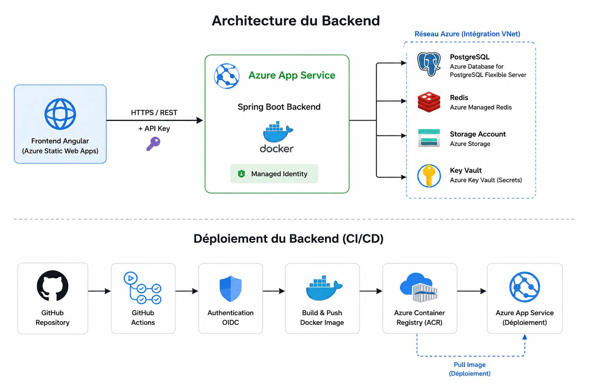

# Azure Quiz — Backend

## Présentation

Ce dépôt contient le backend de l'application **Azure Quiz**.

Le backend est développé avec **Java Spring Boot**, conteneurisé avec **Docker** et déployé sur **Azure App Service**.

Il fournit une API REST utilisée par le frontend Angular.

---

## Architecture

Le backend est hébergé sur Azure App Service sous forme de conteneur Docker.

L'image Docker est construite par GitHub Actions et stockée dans Azure Container Registry.

Le backend communique avec les différents services Azure nécessaires à l'application :

- PostgreSQL pour les données ;
- Azure Managed Redis pour le cache ;
- Azure Storage Account pour le stockage ;
- Azure Key Vault pour les secrets.

---

## Technologies

- Java 21
- Spring Boot
- Maven
- Docker
- PostgreSQL
- Redis
- Azure App Service
- Azure Container Registry
- Azure Key Vault
- GitHub Actions

---

## CI/CD

Le projet utilise **GitHub Actions** pour automatiser les tests, les contrôles de sécurité, la construction de l'image Docker et le déploiement.

La CI vérifie notamment la compilation, les tests et la sécurité du projet.

Le CD construit l'image Docker, la publie dans Azure Container Registry puis déploie la nouvelle version sur Azure App Service.

L'authentification entre GitHub Actions et Azure utilise **OIDC**.

---

## Sécurité

Le backend utilise plusieurs mécanismes de sécurité :

- HTTPS ;
- CORS limité au frontend ;
- clé API pour protéger les appels à l'API ;
- Azure Key Vault pour les secrets ;
- Managed Identity ;
- Azure RBAC ;
- intégration au réseau Azure.

Les secrets applicatifs ne sont pas stockés directement dans le code source.

---

## Déploiement

Le backend est exécuté dans **Azure App Service**.

Les images Docker sont stockées dans **Azure Container Registry**.

L'infrastructure Azure est créée et maintenue séparément avec **Terraform**.

Ce dépôt est principalement responsable du code Spring Boot, des tests, de la construction de l'image Docker et du déploiement applicatif.
